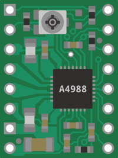
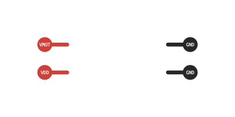
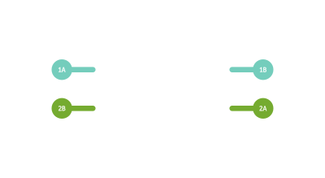
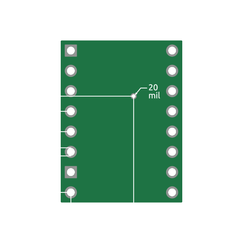
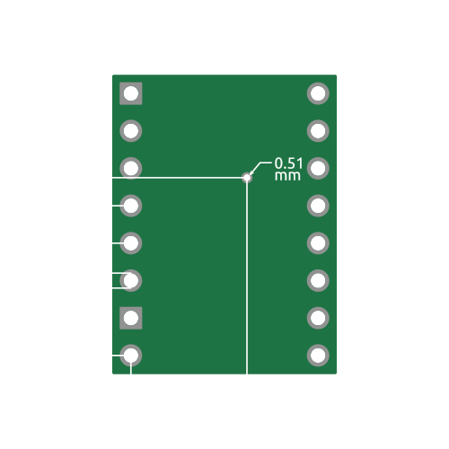

# A4988
The A4988 Stepper Motor Driver Carrier Board

---

*All specs are by default described for the* 
*PCB only, without pin headers, heat sink, ..*

---

### General Specs

|                             | Imperial |  Metric  |
|:---------------------------:|:--------:|:--------:|
| **🡘**                      | 0.6"     | 15.24 mm |
| **🡙**                       | 0.8"     | 20.32 mm |
|| 20.06 gr | 1.3 g    |

---

### Power Specs

⚠ **The PCB does not have Reverse Voltage Protection**

**Maximum continues current per phase.**

---

### Step Types

|  Type  | M3 | M2 | M1 | Dec |
|:------:|:--:|:--:|:--:|:---:|
|   Full |    |    |    |  0  |
| 1 /  2 |    |    |  X |  1  |
| 1 /  4 |    |  X |    |  2  |
| 1 /  8 |    |  X |  X |  3  |
| 1 / 16 |  X |  X |  X |  7  |

---

### Dimensions

|        Imperial         |         Metric        |
| :---------------------: | :-------------------: |
|||
